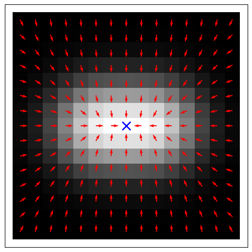
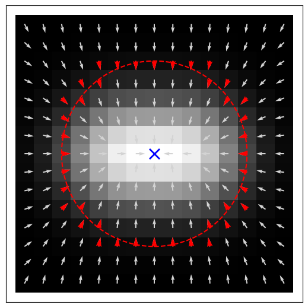
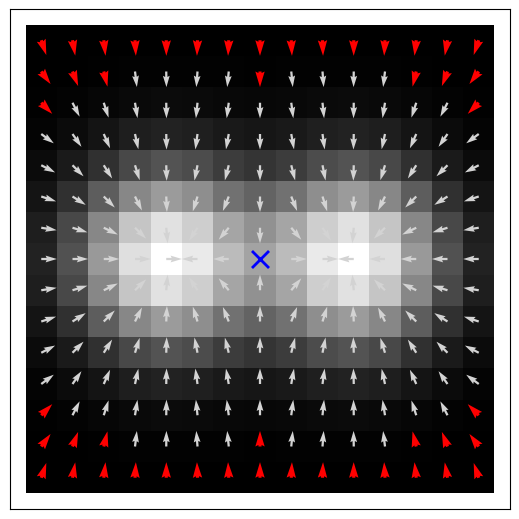
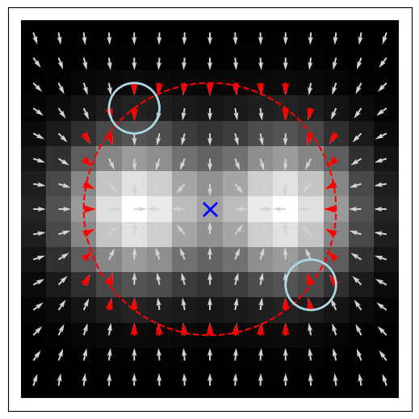

# Gradient Pattern Analysis (GPA)

Python implementation of **Gradient Pattern Analysis (GPA)** for characterizing spatial patterns from scalar fields through gradient fields, symmetry analysis, Delaunay triangulation, and gradient moments.

The library provides a simple interface for applying GPA to numerical matrices and scientific images while preserving the methodology of the original implementation.

---

## Contents

### Getting Started

* [Installation](#installation)
* [Quick Start](#quick-start)
* [Input Data](#input-data)

### GPA Workflow

* [Gradient Field](#gradient-field)
* [Symmetry Identification](#symmetry-identification)
* [Gradient Magnitude Threshold](#gradient-magnitude-threshold)
* [Symmetry Tolerances](#symmetry-tolerances)
* [Pairwise Symmetry Comparison](#pairwise-symmetry-comparison)
* [Delaunay Triangulation](#delaunay-triangulation)

### Documentation

* [Visualization](#visualization)
* [Examples](#examples)
* [Project Structure](#project-structure)

### Background

* [Scientific Background](#scientific-background)
* [References](#references)

### Project

* [Author](#author)
* [Acknowledgements](#acknowledgements)

---

# Installation

The package can be installed directly from GitHub:

```bash
pip install git+https://github.com/Desduh/gpa.git
```

### Requirements

* Python >= 3.9
* NumPy
* SciPy
* Matplotlib

---

# Quick Start

Import the `GPA` class:

```python
from gpa import GPA
```

A complete example is available in:

```text
notebooks/gpa_basic_usage.ipynb
```

The notebook demonstrates the complete GPA workflow, including matrix preparation, gradient analysis, symmetry identification, visualization, and calculation of GPA descriptors.

## Basic workflow

The general GPA workflow is:

```text
Input matrix
     ↓
Gradient field
     ↓
Symmetry identification
     ↓
Asymmetric gradient field
     ↓
Delaunay triangulation
     ↓
GPA descriptors
```

For example, starting from a numerical matrix:

```python
import numpy as np
from gpa import GPA

matrix = np.array([
    [1, 1, 1, 1, 1],
    [1, 2, 2, 2, 1],
    [1, 2, 3, 2, 1],
    [1, 2, 2, 2, 1],
    [1, 1, 1, 1, 1]
])

gpa = GPA(matrix)
```

The resulting object can then be used to visualize the intermediate GPA results and calculate GPA descriptors.

> See `notebooks/gpa_basic_usage.ipynb` for the complete usage example.

---

# Input Data

GPA operates on a **2D scalar field**, represented by a NumPy array.

For example:

```python
symmetric = np.array([
    [1, 1, 1, 1, 1],
    [1, 2, 2, 2, 1],
    [1, 2, 3, 2, 1],
    [1, 2, 2, 2, 1],
    [1, 1, 1, 1, 1]
])
```

This matrix represents a radially symmetric structure.

GPA can also be applied to asymmetric and more complex spatial patterns.

---

# GPA Workflow

## Gradient Field

The first step of GPA is the calculation of the spatial gradient:

$$
\nabla I(x,y) =
\left(G_x(x,y), G_y(x,y)\right).
$$

The gradient magnitude and orientation are then used to characterize the local structure of the scalar field.

The initial gradient field can be visualized as:

<p align="center">
  
</p>

The arrows represent the local gradient vectors, while the marker indicates the analysis center.

---

## Symmetry Identification

One of the main steps of GPA is the identification and removal of **approximately symmetric gradient contributions**.

The algorithm compares gradient vectors according to their positions relative to the analysis center. Symmetric contributions are removed, producing the **asymmetric gradient field** used in the subsequent GPA analysis.

The procedure can be summarized as:

1. Group vectors according to their radial distance from the analysis center.
2. Remove gradients below the magnitude threshold.
3. Compare candidate vector pairs.
4. Evaluate their magnitude, orientation, and spatial opposition.
5. Remove pairs satisfying the symmetry criteria.

### Radial grouping

Vectors with similar distances from the analysis center are grouped together.

<p align="center">
  
</p>

The `radial_distance_tolerance` controls how different two radial distances can be while still belonging to the same radial group.

* Smaller values → stricter radial grouping.
* Larger values → broader radial groups.

---

## Gradient Magnitude Threshold

Very weak gradients can be excluded before symmetry comparisons.

The threshold is defined relative to the maximum gradient magnitude:

$$
\frac{|\nabla I|}
{\max(|\nabla I|)}
\leq T_m.
$$

For example:

```python
magnitude_threshold = 0.10
```

corresponds to **10% of the maximum gradient magnitude**.

<p align="center">
  
</p>

This parameter controls which individual gradient vectors are strong enough to participate in the symmetry analysis.

---

## Symmetry Tolerances

The symmetry analysis uses several independent tolerance parameters. Each parameter controls a different aspect of the symmetry criterion.

| Parameter                      | Controls                             | Unit       |
| ------------------------------ | ------------------------------------ | ---------- |
| `magnitude_threshold`          | Minimum gradient magnitude           | Relative   |
| `radial_distance_tolerance`    | Radial grouping                      | Pixels     |
| `magnitude_tolerance`          | Difference between vector magnitudes | Relative   |
| `angle_tolerance`              | Deviation from opposite orientation  | Degrees    |
| `symmetric_position_tolerance` | Deviation from opposite position     | Percentage |
| `opposite_vector_tolerance`    | Residual of vector opposition        | Relative   |

### `magnitude_threshold`

Defines the minimum gradient magnitude required for a vector to participate in the symmetry analysis.

For example:

```python
magnitude_threshold = 0.10
```

means that gradients at or below 10% of the maximum gradient magnitude are excluded.

---

### `radial_distance_tolerance`

Controls the radial grouping of gradient vectors.

It is expressed in **pixels**.

A smaller value produces narrower radial groups, while a larger value allows vectors at more different radial distances to be compared.

---

### `magnitude_tolerance`

Controls how similar the magnitudes of two candidate vectors must be.

It is expressed **relative to the maximum gradient magnitude**.

For example:

```python
magnitude_tolerance = 0.05
```

allows a magnitude difference of up to 5% of the maximum gradient magnitude.

This parameter is different from `magnitude_threshold`:

* `magnitude_threshold` → determines whether an individual vector is strong enough.
* `magnitude_tolerance` → determines whether two vectors have sufficiently similar magnitudes.

---

### `angle_tolerance`

Controls how closely two vectors must point in opposite directions.

The ideal angular difference is:

```text
180°
```

The parameter is specified in **degrees**.

For example:

```python
angle_tolerance = 10
```

allows a deviation of up to 10° from perfect opposition.

Smaller values produce a stricter angular symmetry criterion.

---

### `symmetric_position_tolerance`

Controls how close two vectors must be to geometrically opposite positions with respect to the analysis center.

This parameter is expressed as a **percentage of the image dimensions**.

For example:

```python
symmetric_position_tolerance = 2
```

allows a positional deviation of approximately 2% of the corresponding image dimension.

Smaller values require more precise spatial opposition.

---

### `opposite_vector_tolerance`

An alternative criterion can be used to determine whether two gradient vectors are approximately equal and opposite.

Instead of independently evaluating their magnitudes and orientations, the algorithm evaluates the normalized magnitude of their vector sum:

$$
R =
\frac{|\mathbf{G}_1+\mathbf{G}_2|}
{|\mathbf{G}_1|+|\mathbf{G}_2|}.
$$

Pairs with sufficiently small residuals are considered opposite.

When `opposite_vector_tolerance` is used, `magnitude_tolerance` and `angle_tolerance` are not used for the vector opposition test.

The spatial opposition criterion remains necessary.

---

## Pairwise Symmetry Comparison

After radial grouping and magnitude filtering, candidate vectors are compared pairwise.

<p align="center">
  
</p>

When the standard criterion is used, a pair is considered symmetric when **all three conditions** are satisfied:

1. Similar gradient magnitude.
2. Approximately opposite orientation.
3. Approximately opposite position relative to the analysis center.

The symmetric contributions are removed from the gradient field, resulting in the asymmetric field:

$$
\nabla I_{\mathrm{asym}}
========================

\nabla I-\nabla I_{\mathrm{sym}}.
$$

This asymmetric field is subsequently used for the GPA analysis.

---

## Delaunay Triangulation

After the asymmetric gradient field has been obtained, the remaining gradient structures can be used to construct a **Delaunay triangulation**.

The triangulation provides a geometric representation of the spatial organization of the remaining asymmetric gradient vectors and is used in the calculation of GPA descriptors.

The triangulation can be visualized with:

```python
gpa.plot_delaunay_triangulation()
```

See the example notebook for different visualization options.

---

# Visualization

The library provides plotting functions for inspecting the intermediate GPA results.

### Gradient field

```python
gpa.plot_gradient_field()
```

### Delaunay triangulation

```python
gpa.plot_delaunay_triangulation()
```

The plotting functions provide options for controlling:

* display of the original image;
* analysis center;
* scale;
* vector length;
* colors;
* other visualization elements.

See `notebooks/gpa_basic_usage.ipynb` for examples of the available options.

---

# Examples

A complete example is provided in:

```text
notebooks/
└── gpa_basic_usage.ipynb
```

The notebook is the recommended starting point for new users.

It demonstrates:

* creation of input matrices;
* initialization of the `GPA` object;
* gradient-field visualization;
* symmetry analysis;
* asymmetric gradient-field visualization;
* Delaunay triangulation;
* calculation of GPA descriptors;
* effects of the main tolerance parameters.

---

# Project Structure

```text
gradient-pattern-analysis/
│
├── gpa/
│   ├── __init__.py
│   └── gpa.py
│
├── notebooks/
│   └── gpa_basic_usage.ipynb
│
├── data/
│   ├── gradient_field.png
│   ├── radial_group.png
│   ├── magnitude_threshold.png
│   └── radial_group_pair.png
│
├── pyproject.toml
└── README.md
```

---

# Scientific Background

Gradient Pattern Analysis (GPA) characterizes spatial structures through their local gradient organization and the asymmetries that remain after symmetric contributions are removed.

The implementation follows the main GPA computational steps:

* spatial gradient calculation;
* gradient magnitude and orientation;
* radial organization of gradient vectors;
* identification of symmetric contributions;
* construction of the asymmetric gradient field;
* Delaunay triangulation;
* calculation of GPA descriptors and gradient moments.

The present implementation is a Python adaptation of the GPA implementation originally developed as part of the **CyMorph** project.

Original implementation:

[CyMorph](https://github.com/rsautter/CyMorph)

The mathematical formulation and GPA descriptors implemented here are based on the published GPA methodology.

---

# Author

**Carlos Eduardo Falandes**

MSc Student in Applied Computing
National Institute for Space Research (INPE)

---

# Acknowledgements

This work is based on the original GPA implementation developed within the **CyMorph** project.

The author acknowledges the developers of CyMorph and the researchers responsible for the development and application of the Gradient Pattern Analysis methodology.

---

# References

## Rosa et al. (2018)

Rosa, R. R., de Carvalho, R. R., Sautter, R. A., et al.

*Gradient pattern analysis applied to galaxy morphology.*

**Monthly Notices of the Royal Astronomical Society: Letters**, 477(1), L101–L105 (2018).

DOI: [10.1093/mnrasl/sly054](https://doi.org/10.1093/mnrasl/sly054)

### Barchi et al. (2020)

Barchi, P. H., de Carvalho, R. R., Rosa, R. R., et al.

*Machine and Deep Learning applied to galaxy morphology - A comparative study.*

**Astronomy and Computing**, 30, 100334 (2020).

DOI: [10.1016/j.ascom.2019.100334](https://doi.org/10.1016/j.ascom.2019.100334)

### Kolesnikov et al. (2024)

Kolesnikov, I., Sampaio, V. M., de Carvalho, R. R., et al.

*Unveiling galaxy morphology through an unsupervised-supervised hybrid approach.*

**Monthly Notices of the Royal Astronomical Society**, 528(1), 82–107 (2024).

DOI: [10.1093/mnras/stad3934](https://doi.org/10.1093/mnras/stad3934)
