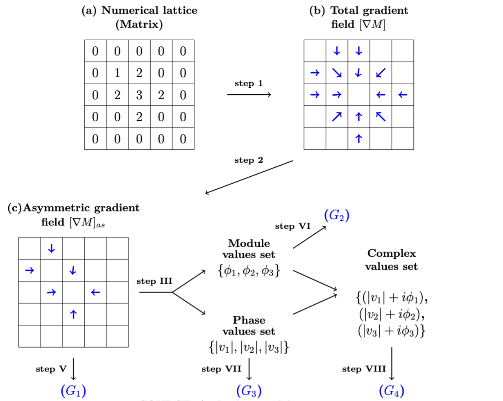
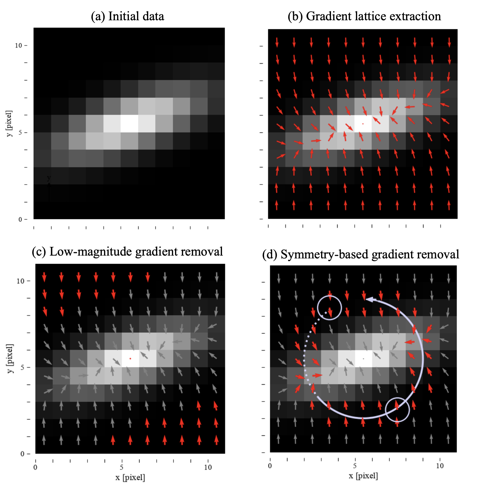

# Gradient Pattern Analysis (GPA)

Python implementation of Gradient Pattern Analysis (GPA) for characterizing spatial patterns in numerical matrices and scientific images.

The library analyzes gradient fields, identifies symmetric contributions, and calculates GPA descriptors and gradient moments.

## Installation

Install the library directly from GitHub:

```bash
pip install git+https://github.com/Desduh/gpa.git
```

### Requirements

- Python >= 3.9
- NumPy
- SciPy
- Matplotlib

## Quick Start

```python
import numpy as np
from gpa import GPA

matrix = np.array([
    [1, 1, 1, 1, 1],
    [1, 2, 2, 2, 1],
    [1, 2, 3, 2, 1],
    [1, 2, 2, 2, 1],
    [1, 1, 1, 1, 1]
])

gpa = GPA(matrix)
```

A complete example is available in:

```text
notebooks/gpa_basic_usage.ipynb
```

## GPA Workflow

The GPA framework illustrates the complete process, from the input matrix to the extraction of GPA descriptors and gradient moments.

<p align="center">
  
</p>

### Gradient Lattice Extraction

The gradient lattice extraction workflow is divided into four main stages:

<p align="center">
  
</p>

- **(a) Initial matrix:** input scalar field.
- **(b) Gradient lattice extraction:** calculation of the spatial gradient.
- **(c) Low-magnitude gradient removal:** removal of weak gradient vectors.
- **(d) Symmetry-based gradient removal:** removal of approximately symmetric gradient contributions.

The resulting asymmetric gradient field is used for the subsequent GPA analysis.

## Implementation Status

| Component | Status |
|---|---|
| G1 | Implemented |
| G2 | Implemented |
| G3 | Not implemented |
| G4 | Not implemented |

## Main Parameters

| Parameter | Description |
|---|---|
| `magnitude_threshold` | Minimum gradient magnitude |
| `radial_distance_tolerance` | Radial grouping tolerance |
| `magnitude_tolerance` | Gradient magnitude similarity |
| `angle_tolerance` | Opposite orientation tolerance (degrees) |
| `symmetric_position_tolerance` | Opposite position tolerance |

## Visualization

Visualize the gradient field:

```python
gpa.plot_gradient_field()
```

Visualize the Delaunay triangulation:

```python
gpa.plot_delaunay_triangulation()
```

## Examples

The example notebook demonstrates:

- Input matrix creation
- Gradient field visualization
- Symmetry analysis
- Asymmetric gradient field extraction
- Delaunay triangulation
- GPA descriptor calculation

```text
notebooks/gpa_basic_usage.ipynb
```

## Project Structure

```text
gradient-pattern-analysis/
│
├── gpa/
│   ├── __init__.py
│   └── gpa.py
│
├── notebooks/
│   └── gpa_basic_usage.ipynb
│
├── data/
│   ├── gpa_framework.png
│   └── gradient_lattice_extraction_workflow.png
│
├── pyproject.toml
└── README.md
```

## Scientific Background

Gradient Pattern Analysis characterizes spatial structures through the organization of local gradients and the asymmetries that remain after symmetric contributions are removed.

This library is a Python adaptation of the GPA implementation originally developed within the CyMorph project.

Original implementation:

[CyMorph](https://github.com/rsautter/CyMorph)

## References

### Rosa et al. (2018)

Rosa, R. R., de Carvalho, R. R., Sautter, R. A., et al.

*Gradient pattern analysis applied to galaxy morphology.*

**Monthly Notices of the Royal Astronomical Society: Letters**, 477(1), L101–L105 (2018).

[DOI: 10.1093/mnrasl/sly054](https://doi.org/10.1093/mnrasl/sly054)

### Barchi et al. (2020)

Barchi, P. H., de Carvalho, R. R., Rosa, R. R., et al.

*Machine and Deep Learning applied to galaxy morphology - A comparative study.*

**Astronomy and Computing**, 30, 100334 (2020).

[DOI: 10.1016/j.ascom.2019.100334](https://doi.org/10.1016/j.ascom.2019.100334)

### Kolesnikov et al. (2024)

Kolesnikov, I., Sampaio, V. M., de Carvalho, R. R., et al.

*Unveiling galaxy morphology through an unsupervised-supervised hybrid approach.*

**Monthly Notices of the Royal Astronomical Society**, 528(1), 82–107 (2024).

[DOI: 10.1093/mnras/stad3934](https://doi.org/10.1093/mnras/stad3934)

## Author

**Carlos Eduardo Falandes**

MSc Student in Applied Computing  
National Institute for Space Research (INPE)